<div align="center">



<br><br>

<a href="https://IMars-kun.github.io/IMars-kun/interactive-terminal.html">

</a>

<sub>a real terminal you can type into — try <code>help</code>, <code>sudo</code>, or something unexpected 👀</sub>

</div>

<br>

## 🧙 Character Sheet

```
┌───────────────────────────────────────────────────┐
│  NAME     Mars                                     │
│  CLASS    Full-Stack Developer / CS Student         │
│  GUILD    TitaniaLab                                │
│  LEVEL    7 — Rising Builder                         │
│  XP       ████████████████░░░░  78%                 │
│  STATUS   🟢 online, shipping something              │
└───────────────────────────────────────────────────┘
```

I level up by breaking things and rebuilding them better. Every side project is a side quest — some give XP, some give bugs at 2AM, all of them count.

<br>

## 🌳 Skill Tree

<table width="100%">
<tr>
<td width="50%" valign="top">

**⚔️ Frontend Branch**
- 🟢 Next.js (App Router) — *maxed*
- 🟢 Tailwind CSS
- 🟢 Framer Motion
- 🟡 Three.js — *leveling up*

</td>
<td width="50%" valign="top">

**🛡️ Backend Branch**
- 🟢 PHP (Native & OOP/MySQLi)
- 🟢 PostgreSQL / MySQL
- 🟡 WebSocket / Real-time systems
- 🔓 Docker

</td>
</tr>
</table>

<br>

## 📜 Quest Log

<table width="100%">
<tr><th align="left">Quest</th><th align="left">Difficulty</th><th align="left">Reward</th><th align="left">Status</th></tr>
<tr>
<td><b>💍 NiatKawin</b><br><sub>digital wedding invitation platform</sub></td>
<td>★★★★☆</td>
<td>CMS + admin dashboard + QR check-in</td>
<td>🟢 Live</td>
</tr>
<tr>
<td><b>📸 SnapFrame</b><br><sub>real-time photobooth web app</sub></td>
<td>★★★☆☆</td>
<td>16 templates, live filters</td>
<td>✅ Complete</td>
</tr>
<tr>
<td><b>🤖 Telegram AI Chatbot</b><br><sub>grammY + Claude API + PostgreSQL</sub></td>
<td>★★★☆☆</td>
<td>Dockerized, production-ready</td>
<td>✅ Complete</td>
</tr>
<tr>
<td><b>📚 BiblioNova / BookVault</b><br><sub>PHP library & book CRUD systems</sub></td>
<td>★★☆☆☆</td>
<td>Two CRUD philosophies mastered</td>
<td>✅ Complete</td>
</tr>
<tr>
<td><b>🎟️ Event Ticketing</b><br><sub>real-time QR check-in dashboard</sub></td>
<td>★★★★☆</td>
<td>WebSocket mastery</td>
<td>🟡 In progress</td>
</tr>
</table>

<br>

## 🏆 Achievements

<div align="center">


</div>

<br>

## 📡 Live Telemetry

<div align="center">


</div>

<div align="center">

</div>

<br>

<picture align="center">
  <source media="(prefers-color-scheme: dark)" srcset="https://raw.githubusercontent.com/IMars-kun/IMars-kun/output/github-contribution-grid-snake-dark.gif">
  <source media="(prefers-color-scheme: light)" srcset="https://raw.githubusercontent.com/IMars-kun/IMars-kun/output/github-contribution-grid-snake.gif">
  
</picture>

<br>

## 📞 Send a Signal

<div align="center">

[](https://niatkawin.titanialab.com)
[](mailto:youremail@example.com)
[](#)
[](#)

</div>

<div align="center"><sub>Thanks for stopping by. Go run that interactive terminal — it's the best part. 🕹️</sub></div>

